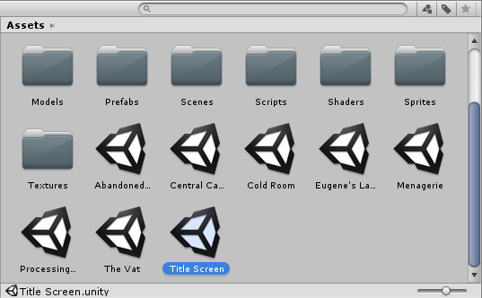

# Cenas 

As cenas contém os objetos de seu jogo. Elas podem ser utilizadas para criar o menu principal, níveis individuais ou qualquer outra coisa. Pense em uma cena como um nível. Em cada cena, você irá colocar seus ambientes, obstáculos, decoração, essencialmente desenvolver as peças de seu jogo.

Quando você cria um novo projeto no Unity, sua janela de cena ira apresentar uma cena vazia. A cena estará vazia, exceto pelos objetos padrões – uma câmera ortográfica ou uma câmera de perspectiva e uma luz direcional, dependendo se você iniciou o projeto em modo 2D ou 3D.

## Salvando cenas

Para salvar uma cena escolha **File > Save Scene** no menu ou pressione **Ctrl + S**.

Cenas são salvas como assets em sua pasta de assets. Por isso, eles aparecem na janela do projecto, assim como qualquer outro asset.

## Abrindo cenas
Para abrir uma cena, para começar ou continuar a trabalhar nela, clique duas vezes sobre ela na janela **project**.

Caso sua cena contenha alterações não salvas, uma janela de confirmação será exibida, perguntando se você quer salvar ou descartar as alterações.