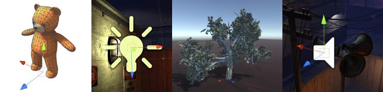

# GameObjects

Os **GameObject** são os tipos de objetos mais importantes do Unity. É muito importante entender o que é um GameObject e como ele pode ser usado.

## O que são GameObjects?

Cada objeto em seu jogo é um **GameObject**. Entretanto, o fazem nada sozinhos.**GameObject** Eles precisam de propriedades especiais para se tornarem um personagem, um ambiente ou um efeito especial. Mas cada um desses objetos são coisas diferentes. Se todo objeto é um **GameObject**, como nós diferenciamos um objeto iterativo de um estático? O que faz esses **GameObject** diferentes um dos outros?

Quatro tipos de objetos, um personagem animado, uma luz, uma árvore e um áudio.
A resposta a esta pergunta é que **GameObject** são recipientes . Eles podem conter as diferentes peças que são necessárias para tornar um personagem, uma luz, uma árvore, um som, ou qualquer outra coisa que você gostaria de construir. Então, para realmente entender **GameObject** , você tem que entender essas peças que são chamados de componentes.

Dependendo do tipo de objeto que você deseja criar , você irá adicionar diferentes combinações de componentes para o GameObject . Pense em um GameObject como uma panela vazia, e seus respectivos componentes como ingredientes que compõem a sua receita do jogo . Unity tem um monte de tipos de componentes, e você também pode fazer seus próprios componentes usando scripts .

Nesta seção vamos explicar como **GameObject**, componentes e scripts se interagem e como criá-los.

