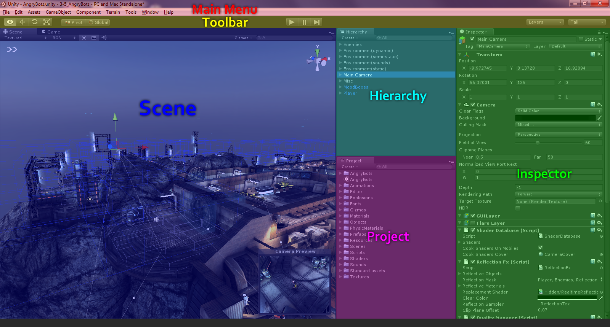
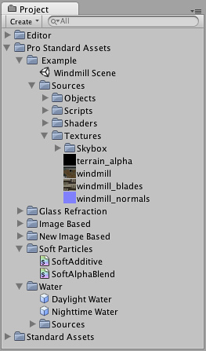
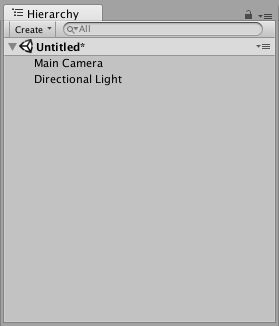
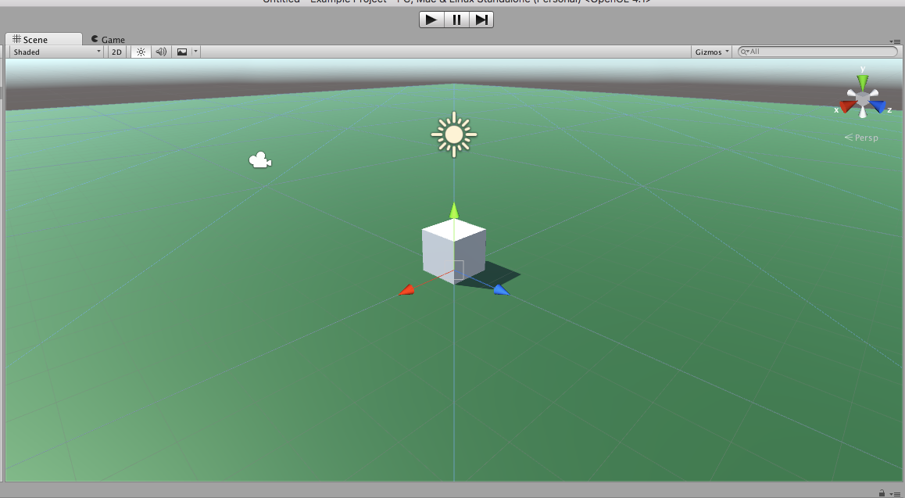
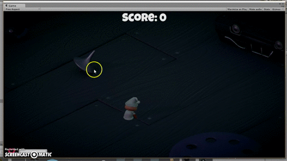
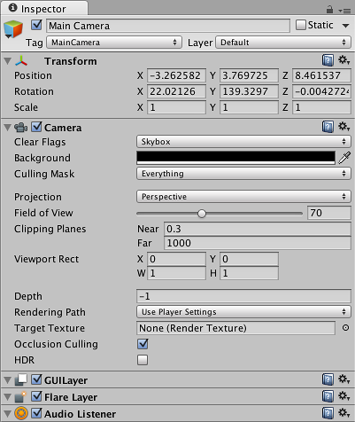

# Interface 

O  motor  de  jogos  Unity3D  possui  uma  interface  bastante simples  e  amigável que  objetiva
facilitar  o  desenvolvimento  de  jogos  de  diversos  gêneros  e  outros  sistemas  de  visualização.  
Sua  área  de  trabalho  é  composta  de  várias  janelas  chamadas  views,  cada  uma  com  um
propósito específico. A figura abaixo é uma captura contendo uma representação esquemática 
e a identificação de cada uma dessas janelas no editor de cenas da Unity3D.

## Project view

A janela Project é a interface para manipulação e organização dos vários arquivos (Assets) que 
compõem um projeto tais como scripts, modelos, texturas, efeitos de áudio e Prefabs. A estrutura exibida  na  janela Project é 
correspondente à  sub‐pasta  Assets  dentro  da  pasta  do  projeto  no  sistema  de  arquivos  do 
computador. Recomenda‐se  que  a  manipulação  de  sua  estrutura  e  conteúdo seja  efetuada somente dentro da Unity3D, a fim de manter a integridade dos metadados que são associados 
a  estes  elementos.  Entretanto,  certas  mudanças,  como  atualização  de  uma  textura  por  um 
editor de imagens por exemplo, ou mesmo a adição de novos Assets, pode ser feita de forma 
segura diretamente no sistema de arquivos.

## Hierarchy view

A janela Hierarchy exibe  todos os elementos da cena que encontram‐se na cena que  se está 
editando.    Além  disso,  nessa  janela  podemos  organizar  e  visualizar  a  hierarquia  de  de 
composição entre  os  vários objetos que  compõem a  cena  (grafo  de  cena).

## Scene view

A janela Scene é a forma principal de manipulação dos elementos visuais no editor de cenas da 
Unity,  possibilitando a  orientação  e  posicionamento  desses  elementos  com  um  feedback
imediato do efeito das alterações efetuadas. Nesta janela, pode‐se manipular graficamente os 
objetos através das opções de arrastar e soltar com o mouse. pode‐se  manipular  objetos  tais  como câmeras, 
cenários, personagens e todos os elementos que compõem a cena. 
Devido a sua grande importância durante o desenvolvimento de uma aplicação, várias formas 
de navegação são oferecidas a fim de aumentar ainda mais a produtividade do desenvolvedor. 
Além  disso,  as  ferramentas  básicas  de  manipulação  dos  elementos  da  cena,  tais  como  pan, 
translação, rotação e escala também estão disponíveis para utilização nesta janela através de 
atalhos de teclado (teclas Q, W, E e R e T).

## Game view

A  janela Game   é  responsável  pela  visualização  da  aplicação  em  desenvolvimento  da  forma 
que ela será exibida quando  finalizada. Nessa janela, pode‐se rapidamente ter uma prévia de 
como os elementos estão se comportando dentro da aplicação. Além disso, a Unity fornece a 
opção de se paralisar (botão pause) a simulação enquanto ela estiver em depuração, de forma 
a  possibilitar  que  os  parâmetros  dos  vários  elementos  possam  ser  ajustados  para 
experimentação. Lembramos que o ajuste desses parâmetros não necessitam que a simulação 
esteja paralisada, podendo ser alterados inclusive enquanto a simulação esteja em execução.
Nesta  janela,  também  pode‐se  visualizar  várias  informações  estatísticas  (stats) sobre  a 
simulação, tais como tempo de processamento e número de frames por segundo, número de 
triângulos  e  vértices  renderizados,  memória  de  textura  utilizada,  entre  outras.  Esta  opção  é 
importante  para  a  depuração  do  desempenho  da  simulação  para  uma  posterior  otimização, 
caso seja necessário.

## Inspector view

Na janela Inspector, tem‐se acesso aos vários parâmetros de um objeto presente no cenário,
bem  como  aos  atributos  de seus  componentes (Components).  Essa  estrutura  utilizada  pela 
Unity para a composição de objetos será melhor explicada na próxima seção. Ainda na janela 
Inspector,  pode‐se ajustar os atributos públicos  (parâmetros)  de  cada  componente,  inclusive 
durante a execução da aplicação.

