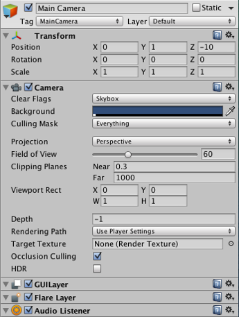

# Introdução aos componentes

Como descrito anteriormente em **GameObjects**, um **GamoObject** contém componentes. Vamos discutir esse relacionamento falando sobre o **GameObject** 
e seus componentes mais comuns – o componente Transform. Com qualquer cena no Unity, crie um novo objeto 
(usando **Shift-Control-N* no Windows ou Shift-Command-N no Mac), selecione-o e dê uma olhada no inspetor.

O inspetor de um **GameObject** vazio.
Veja que um **GameObject** vazio ainda contém um nome, uma **tag**, e um **layer**. Todo **GameObject** também contém um componente do tipo **Transform**.

## O componente transform
É impossível criar um **GameObject** no Unity sem um componente do tipo **transform**. O componente **Transform** é um dos mais importantes componentes, 
desde que todos as propriedades do objeto **Transform** estão disponíveis para serem utilizadas. Ela define a posição, rotação e escala no jogo. 
Se um GameObject não tem um componente Transform, ele não seria nada mais do que uma informação na memória do computador. Ele efetivamente não 
existiria no mundo de seu jogo.

O componente **Transform** também disponibiliza um conceito chamado Parenting, que é a utilização do editor do Unity e sua parte crítica em trabalhar 
com GameObject.

## Outros componentes
O componente transform é crítico em todos os objetos, então todo GameObject tem um. Mas GameObjects contém outros componentes também.

A câmera principal que é adicionada a toda cena por padrão.
Olhando a câmera principal, você pode ver que ela contém uma grande coleção de componentes. Especificamente, o componente câmera, GUILayer, a 
Flare Layer e um Áudio Listener. Todos esses componentes fornecem funcionalidade adicional ao GameObject . Sem eles, não haveria nada para a pessoa 
jogar! Rigidbodies , Colliders , partículas , e de áudio são todos diferentes componentes (ou combinações de componentes) que podem ser adicionados 
a qualquer GameObject .

