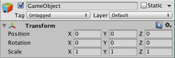

# TRansform
O componente Transform determina a posição, rotação e escala de cada objeto na cena. Todo objeto possui um Transform.

## Propriedades

|**Propriedade:**   |**Função:**                                              |
|-------------------|---------------------------------------------------------|
|**Posição**	    |Posição nas coordenadas X, Y, Z.                         |
|**Rotação**	    |Rotação nas coordenadas em X, Y, Z media em graus.       |
|**Escala**	        |Escala nos eixos X, Y, Z. Sendo que o valor original é 1.|

O valor da posição, rotação e escala são medido relativamente ao Transform do pai.
Se o **Transform** não possui pai, as propriedades são medidas no mundo do jogo.

