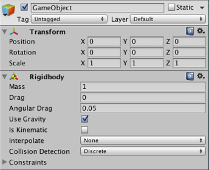
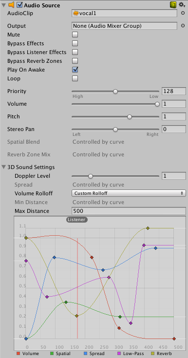
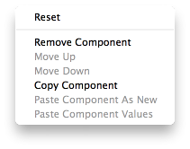

# Usando Componentes

Os componentes são as porcas e parafusos dos objetos e comportamentos em um jogo. Eles são as peças 
funcionais de cada **GameObject**.

Um **GameObject** é um recipiente para muitos componentes diferentes. Por padrão, todos **GameObjects** 
automaticamente têm uma componente do tipo **Transform**. Isso ocorre porque o esse componente indica onde o 
**GameObject** está localizado, e como ele está girado e dimensionado. Sem um componente do tipo **Transform**, o 
**GameObject** não teria um lugar em seu jogo. Tente criar um vazio GameObject agora, como um exemplo. 
Clique no **GameObject– > Criar item de menu vazio** . Selecione o novo **GameObject** , e olhe para o inspetor. 

Até um GameObject vazio tem um componente do tipo **Transform**
Lembre-se que você sempre pode usar o Inspetor para ver quais componentes estão anexados ao **GameObject** selecionado.
Assim como um componente é adicionado e removido, o inspetor irá sempre demonstrar a você quais componentes estão 
anexados atualmente. Você irá utilizar o inspetor para alterar as propriedades de qualquer componente.

## Adicionando componentes

Você pode adicionar componentes para o **GameObject** selecionado através do menu **Components**. 
Vamos tentar adiconar agora um **Rigidbody** ao **GameObject** vazio que acabamos de criar. 
O selecione e escolha **Component->Physics->Rigidbody** no menu.

Quando você fizer, você verá a propriedade Rigidbody aparecer no inspetor. Se você pressionar 
Play enquanto o objeto estiver selecionado, você terá uma pequena surpresa. Faça e veja a funcionalidade 
adicionada pelo Rigidbody ao objeto vazio. (A posição Y do objeto começará a diminuir. Isso acontece pois 
a física do objeto o está fazendo cair por causa da gravidade).

Um objeto vazio com um componente Rigidbody anexado.
Outra opção é usar o Component Browser, que pode ser ativado através do botão Add Component no inspetor do objeto.

O componente navegador.
O navegador permite você navegar entre os componentes por categoria e também possui uma caixa de 
pesquisa para que você possa localizar os componentes por nome.

Você pode anexar quanto componentes quiser a um objeto. Alguns componentes funcionam melhores com outros. 
Por exemplo, o **Rigidbody** funciona melhor com um **Collider**. O **Rigidbody** controla o **Transform** através de um 
motor de física **NVIDIA PhysX**, e um **Collider** permite um **Rigidbody** colidir e interagir com outros colisores.

## Editando componentes
Um dos grandes aspectos dos componentes é a sua flexibilidade. Quando você anexa um componente a um objeto, 
existem três valores diferentes ou propriedades no componente que podem ser ajustadas no editor enquanto 
estiver fazendo um jogo ou por scripts enquanto estiver executando um jogo. Existe dois tipos de propriedades 
principais: Valores e Referências.

Olhe a imagem abaixo. É um bojeto vazio com um componente de áudio. Todos os valores do componente **Audio Source** 
estão com valores padrão no inspetor.

Esse componente possui uma única propriedade de referência e sete propriedades de valor. 
**Audio Clip** é a propriedade de referência. Quando o áudio começar a ser executado, ele poderá executar 
o áudio que está sendo referenciado na propriedade **Audio Clip**. Caso nenhuma referência esteja sendo 
feita, um erro irá ocorrer. Você deve referenciar o arquivo dentro do inspetor. Isso é tão fácil 
quanto arrastar um arquivo de áudio da janela de projeto para a propriedade do objeto selecionado.

Agora um arquivo de som está sendo referenciado na propriedade Audio Clip
Componentes podem conter referências de qualquer outro tipo de componente, objeto ou asset.

As propriedades restantes do áudio são todas propriedades. Elas podem ser ajustadas diretamente no 
inspetor. O valor das propriedades do clipe de áudio são todos valores numéricos , campos drop-down, 
mas as propriedades de valor também pode ser strings, cores, curvas ou outros tipos.

## Menu de comandos do componente de contexto
O menu de contexto de um componente tem vários comandos úteis.

O menu do componente de contexto
O mesmo comando pode também estar disponível no ícone “gear” no canto superior direito do painel do 
componente no inspetor.

## Reset
Esse comando restaura os valores das propriedades que os componentes tinham antes da edição.

## Remove
O comando **Remove Component** está disponível para quando você não quiser mais aquele componente 
anexado ao objeto. Perceba que alguns componentes dependem uns dos outros (exemplo, Hinge Join só 
funciona quando anexado a um **Rigidbody**). Você verá uma mensagem de alerta caso remova um componente que 
dependa de outro.

## Move Up/down
Os componentes de efeitos de imagens podem ser utilizados para exibir efeitos visuais específicos na tela, 
mas a ordem em que esses efeitos são aplicados é muito importante. O menu de contexto possui **Move Up** e **Move 
Down** para alterar as ordens do mesmos.

## Copy/Paste
O componente copiar / colar armazena o tipo e a propriedade atual de um componente, assim eles podem ser 
colados em outro componente. Você também pode criar um outro componente com os valores copiados.

## Testando as propriedades
Enquanto seu jogos estiver em modo **Play**, você pode alterar as propriedades no inspetor de qualquer objeto. 
Por exemplo, se você quiser experimentar diferentes alturas de um pulo. Se você criar uma propriedade 
**Jump Height** no script, você pode entrar em modo **Play**, alterar o valor e ver o que acontece. 
Quando sair do modo **Play** você pode alterar novamente e ver os resultados em segundos. Quando sair do modo **Play**, 
todos os valores alterados serão retornados para os valores que continham antes para que você não 
perca nenhum trabalho. O Unity te dá um incrível poder para experimentar os ajustes e definir as 
configurações de seu jogo sem perder muito tempo com iterações. Tente alterar qualquer propriedade com o seu jogo
 em modo **Play**. Temos certeza que você ficará impressionado.

